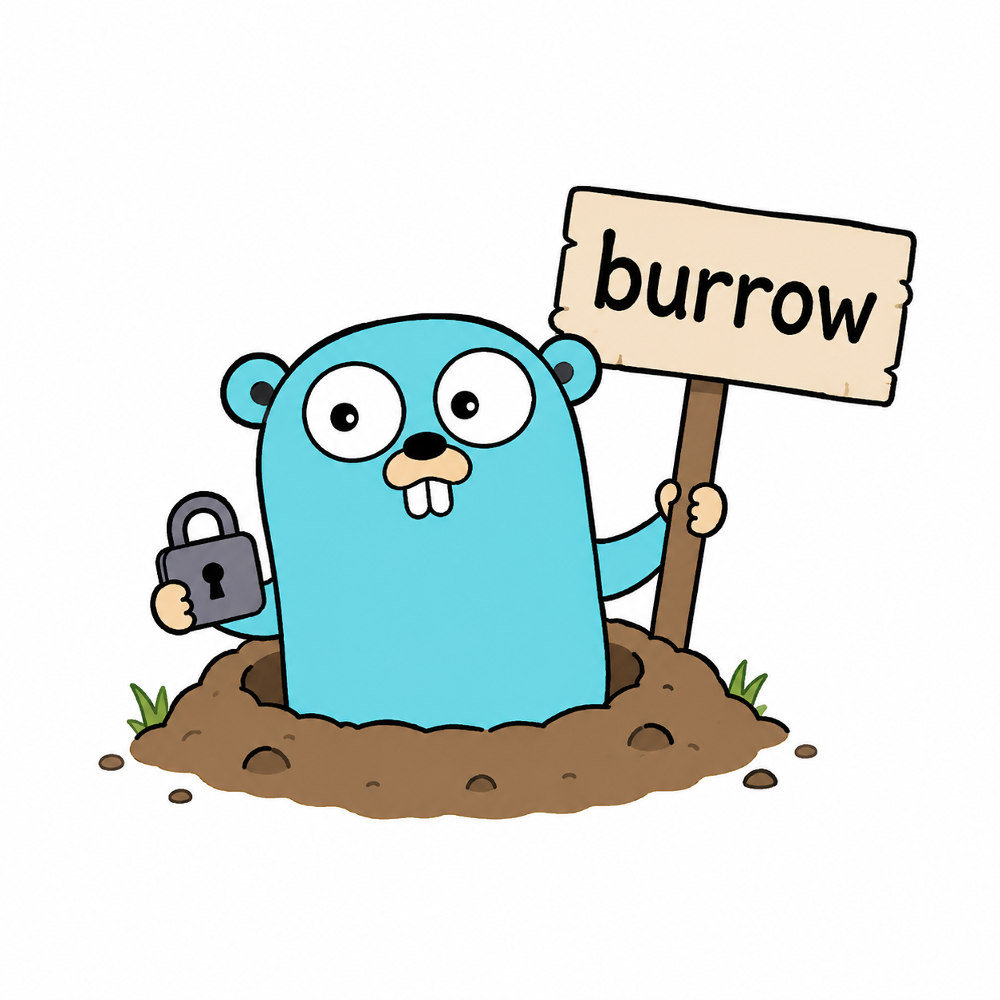

# Burrow

<p align="center">
  
</p>

Burrow is an encrypted peer-to-peer file transfer tool. Inspired by the Python [magic-wormhole](https://github.com/magic-wormhole/magic-wormhole), a gopher's home is a burrow, hence the name.

You share a short code between two machines. The actual file data never touches any server in plaintext.

## What Burrow adds over magic-wormhole

| Feature                          | magic-wormhole | Burrow                    |
| -------------------------------- | -------------- | ------------------------- |
| CLI send / receive               | yes            | yes                       |
| Browser upload (`receive-web`) | no             | yes                       |
| Language                         | Python         | Go (single static binary) |
| Self-hostable infra              | no             | yes                       |

`receive-web` lets the receiver generate a QR code. Whoever scans it gets a drag-and-drop upload page in their browser.

## Install

Requires Go 1.22+.

```bash
go install github.com/maxcraig112/burrow/cmd/wormhole@latest
```

Points at the hosted servers by default, no setup needed.

## Usage

### Send a file

```bash
wormhole send photo.jpg
```

```text
Code: swift-copper-leaps
On the other machine run:

    wormhole receive swift-copper-leaps

Waiting for receiver...
Receiver connected. Sending photo.jpg (4.2 MB)...
  [████████████████████████████] 100.0%  4.2 MB / 4.2 MB  12.3 MB/s  (0s)
Done!
```

### Receive a file

```bash
wormhole receive swift-copper-leaps
```

```text
Receiving photo.jpg (4.2 MB)...
  [████████████████████████████] 100.0%  4.2 MB / 4.2 MB  10.8 MB/s  (0s)
Saved to photo.jpg
Done!
```

### Receive via browser

```bash
wormhole receive-web
```

```text
Code: misty-harbor-glides
Scan the QR code or open in a browser:
  http://34.171.119.185:8082/t/misty-harbor-glides/

[QR CODE]

Waiting for uploads — press Ctrl+C to stop.
```

Files are saved to the current working directory. Accepts multiple uploads until you hit Ctrl+C.

## Security

- Key exchange uses X25519 ECDH with HKDF-SHA256
- Files are encrypted with AES-256-GCM before leaving your machine
- The relay only sees ciphertext, never the actual files
- The exchange server only sees public keys, never file data

## Docs

- [Building from source &amp; local dev](docs/development.md)
- [Deployment (GCP / Terraform)](docs/deployment.md)
