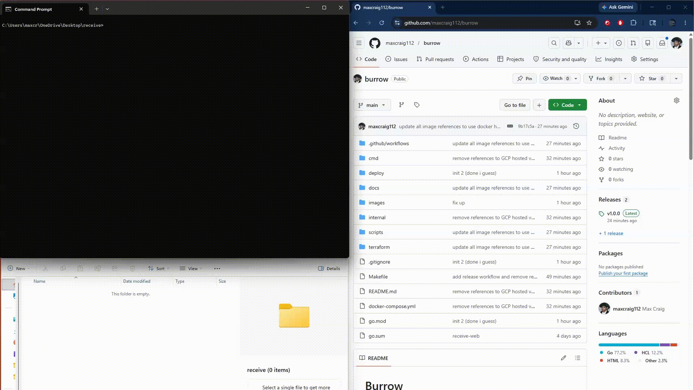

# Burrow

<p align="center">
  
  <br/>
  <em>A gopher hole is called a burrow</em>
</p>

<p align="center">
  <a href="https://github.com/maxcraig112/burrow/actions/workflows/lint.yml"></a>
  <a href="https://github.com/maxcraig112/burrow/actions/workflows/e2e.yml"></a>
  <a href="https://github.com/maxcraig112/burrow/actions/workflows/docker-build.yml"></a>
  <a href="https://hub.docker.com/r/maxcraig112/burrow-relay"></a>
  <a href="https://hub.docker.com/r/maxcraig112/burrow-relay"></a>
</p>

Burrow is an encrypted peer-to-peer file transfer tool inspired by [magic-wormhole](https://github.com/magic-wormhole/magic-wormhole).

Burrow allows you to establish a single or multi-file connection between any two machines, and securly transfer files between them. Burrow features a secure key exchange and file transfer through a relay server, which has the benefit of ensuring your files are not publically accessible and can bypass NAT issues.

<p align="center">
  
  <br/>
  <em>Demo of burrow receive-web</em>
</p>


## Features

| Feature                          | magic-wormhole | Burrow                    |
| -------------------------------- | -------------- | ------------------------- |
| CLI send / receive               | yes            | yes                       |
| Directory transfer               | yes            | yes                       |
| Persistent browser upload (`receive-web`) | no             | yes                       |
| Language                                    | Python         | Go (single static binary) |
| Self-hostable infra                         | no             | yes                       |

The main difference that burrow has over magic-wormhole is the ability for the receiver to initiate the file transfer. A long lived session can be established, which allows multiple senders to connect to uploading multiple files through a dedicated Web UI.

## Use cases

- **Phone to computer** - scan the QR code from `receive-web` and upload straight from your camera roll
- **Computer to computer** - transfer any file with a short code, no accounts or cloud needed
- **Collecting files from multiple people** - `receive-web` stays open until you close it
- **Home server drop box** - leave `receive-web` running, anyone on your network can drop files

## Install

Requires Go 1.22+.

```bash
go install github.com/maxcraig112/burrow@latest
```

You'll need to point it at a server, see [self-hosting](docs/self-hosting.md) to run your own, then run `burrow config` once to configure server addresses.

## Usage

### Send a file or directory

```bash
burrow send photo.jpg        # single file
burrow send ./project/       # entire directory
```

```text
Code: swift-copper-leaps
# On the other machine run:

  burrow receive swift-copper-leaps

Waiting for receiver...
Receiver connected. Sending photo.jpg (4.2 MB)...
  [████████████████████████████] 100.0%  4.2 MB / 4.2 MB  12.3 MB/s  (0s)
Done!
```

### Receive a file or directory

```bash
burrow receive swift-copper-leaps
```

```text
Receiving photo.jpg (4.2 MB)...
  [████████████████████████████] 100.0%  4.2 MB / 4.2 MB  10.8 MB/s  (0s)
Saved to photo.jpg
Done!
```

For a directory transfer the receiver sees each file as it arrives and the directory is recreated in the current working directory.

### Receive via browser

```bash
burrow receive-web
```

```text
Code: misty-harbor-glides
# Scan the QR code or open in a browser:
  http://your-server:8082/t/misty-harbor-glides/

[QR CODE]

Waiting for uploads — press Ctrl+C to stop.
```

Files are saved to the current working directory. Accepts multiple uploads until you hit Ctrl+C.

## Security

- Key exchange uses X25519 ECDH with HKDF-SHA256
- Files are encrypted with AES-256-GCM before leaving your machine
- The relay only sees ciphertext, never the actual files
- The exchange server only sees public keys, never file data

## Docs

- [Building from source &amp; local dev](docs/development.md)
- [Self-hosting on a home server](docs/self-hosting.md)
